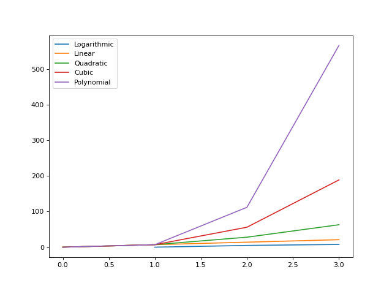
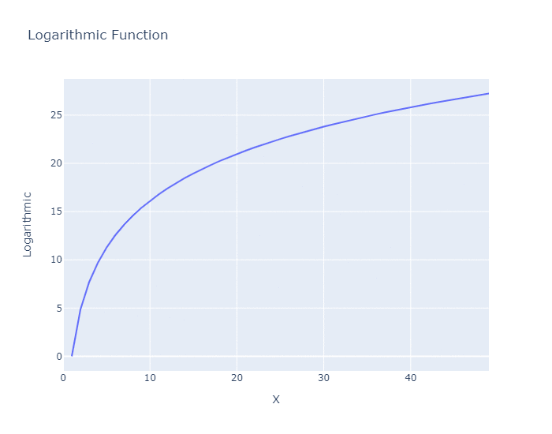
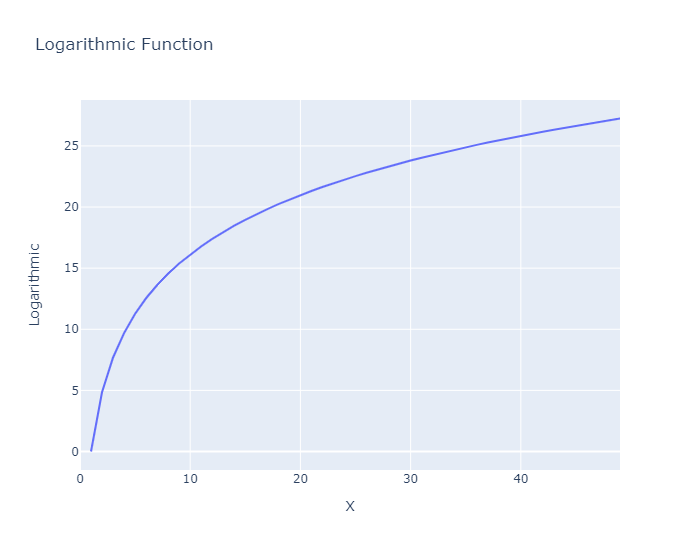

# Comparison of the Equations:

The Functions are:

1. Logarithmic = θ(log n)
2. Linear = θ(n)
3. Quadratic = θ(n²)
4. Cubic = θ(n³)
5. Polynomial = θ(n^k)

Input Values: n=7, k=4

  

These functions are used to acknowledge time and space complexity
- Among these equations, Logarithmic function( θ(log n) ) is the best.

  
Logarithmic function indicates, if input size increases linearly, the number of elements to execute also increases in inverse exponential manner. Logarithmic functions work on divide and search type of algorithms e.g binary search and quick sort.
